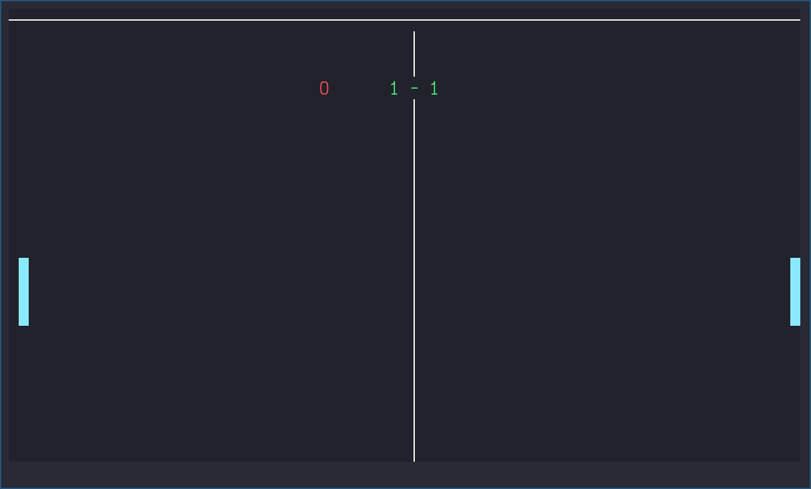

# Ping pong



* [Introduction](#introduction)
* [Goals](#goals)
* [Build](#build)
* [How to Play](#how-to-play)

### Introduction

A simple two-player ping-pong in the terminal using [ncurses](https://en.wikipedia.org/wiki/Ncurses) 

### Goals
- Learn basic control structures in C
- Get better at using [ncurses](https://tldp.org/HOWTO/NCURSES-Programming-HOWTO/)  

### Build

```
$ git clone git.github.com:bezlant/s21_pong.git
$ cd s21_pong/src
$ make
```

### How to Play
* `A` & `Z` for the *Left Player* 
* `K` & `M` for the *Right Player*
* To quit press `Q`
